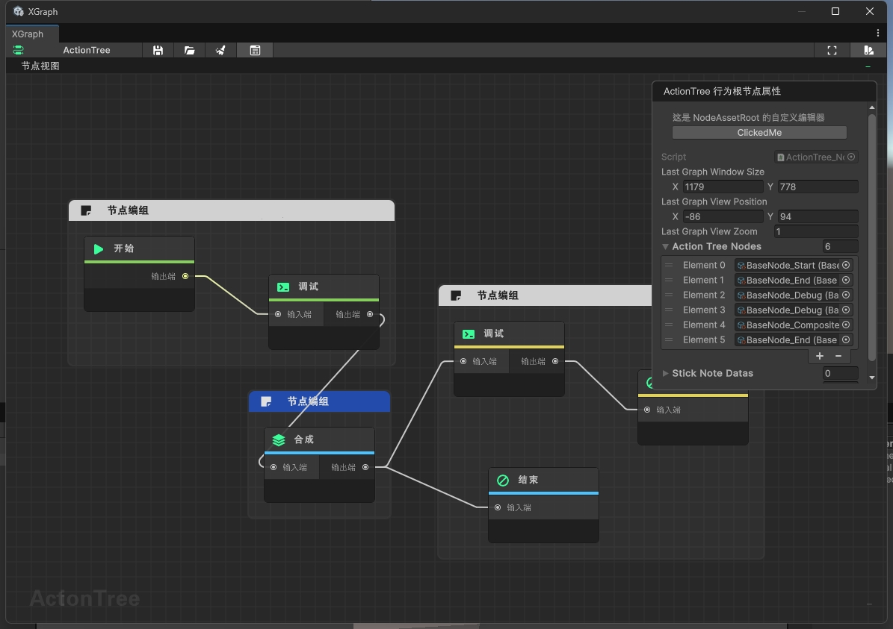
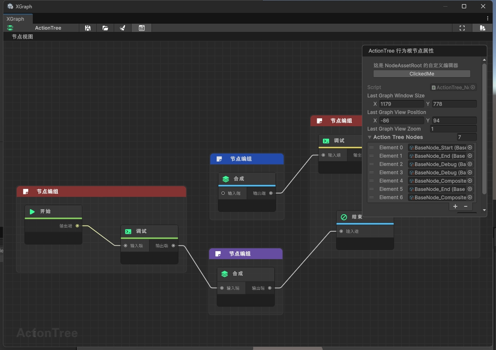
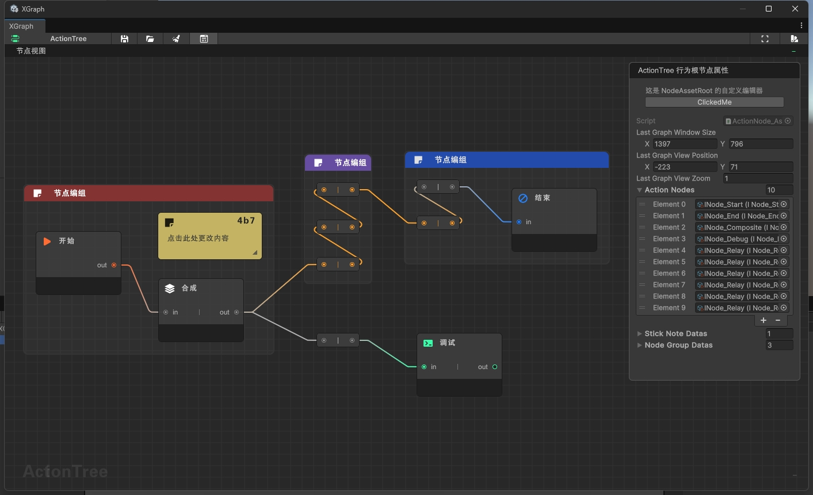

这是一个为 Unity 引擎设计的可视化行为树（ActionTree）编辑器，采用 Unity 的 GraphView 框架构建，提供了一个直观、灵活的节点式编辑体验，支持复杂的逻辑流程设计、调试与运行。

### :zap: **开源不易，您的支持是持续更新的动力！**
### **如果您觉得这个工具为您节省了时间、解决了问题，甚至只是带来了一丝愉悦——请考虑赞助一杯咖啡。微小的支持都能让我知道：有人在乎这份付出，而这将成为我熬夜修复Bug、添加新功能的最大动力。** 

### **这个小工具倾注了我无数个深夜的调试与优化，它永远免费，但绝非无成本。平时的生活费用、开发工具订阅、测试与维护… 这些都在默默消耗着资源。开源不是用爱发电，您的认可会让它走得更远。** 

### **我们会明确记录赞助者的名字并将每一位赞助者加入至工具的赞助名单中公示，衷心感谢每一位使用者 ！** 

### :zap: **技术群交流**

### :zap: **核心功能**
 
-  **节点式编辑** 
-  **提供多种行为节点类型（开始、结束、组合、等待、调试等）。** 
-  **支持节点之间的连线、编组、复制、粘贴和克隆操作。** 
-  **支持便签（StickNote）功能，便于添加注释和说明。** 

### :zap: **运行时支持** 

-  通过 ActionTreeRunner 组件在游戏运行时执行行为树。
-  支持运行时调试信息输出，便于实时查看节点执行情况。
-  编辑体验优化
-  支持节点颜色标记，便于分类和识别。
-  支持节点编组（Group），方便管理复杂逻辑。
-  支持窗口布局记忆，保存和恢复编辑状态。
-  主题与样式
-  提供多种主题配色方案，支持自定义节点和背景颜色。
-  使用 USS（Unity Style Sheet）实现灵活的样式定制。

### :zap: **技术架构** 

##### > **数据层** 
ActionTree_Node_Base 及其子类定义了行为树节点的数据结构和执行逻辑。
ActionTree_Nodes_Asset 作为行为树的资源容器，管理节点数据和便签信息。

##### > **视图层** 
xg_GraphView 作为主视图，负责节点和连线的绘制与交互。
xGraphNode_Base 及其子类定义了各种节点视图的绘制逻辑。
xGraphNode_StickNote 提供了便签节点的视图实现。

##### > **控制层** 
xg_Window 作为主窗口，提供菜单、工具栏和属性面板。
xg_InspectorView 提供节点的属性编辑功能。
ActionTreeRunner 在游戏运行时执行行为树逻辑。

###   :beginner:   **使用场景** 

##### > AI 行为设计
设计 NPC、敌人的行为逻辑，如巡逻、追击、攻击等。

##### > **任务系统** 
构建复杂的任务流程，支持条件判断和分支逻辑。

##### > **动画控制** 
通过行为树控制角色动画的切换和组合。

##### > **游戏流程** 
设计游戏的整体流程，如关卡加载、剧情推进等。

###  :electric_plug:  **扩展性** 

##### > **节点扩展** 
通过继承 ActionTree_Node_Base 或其子类，可以自定义新的节点类型。

##### > **主题扩展** 
通过修改 Themes.json 文件，可以添加新的主题配色方案。

##### > **功能扩展** 
支持自定义编辑器脚本，扩展节点的属性面板功能。

###  :zap:  **设计亮点** 

##### > **可视化与代码分离** 
行为逻辑完全通过可视化编辑完成，无需编写代码。

##### > **实时预览** 
运行时支持实时查看节点执行情况，便于调试。

##### > **数据驱动** 
行为树数据以资源形式保存，便于版本控制和团队协作。

 **这个编辑器不仅是一个工具，更是一个行为逻辑的设计平台，让开发者能够专注于创意的实现，而不是繁琐的代码细节。** 
