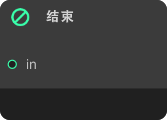
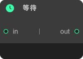

## XGraph 流程图插件

### 概述
------------
XGraph 是一款基于 Unity Editor 的可视化节点编辑器插件，专为行为树（Behavior Tree）、状态机（State Machine）、任务流（Task Flow）等图形化逻辑设计而开发。它采用 GraphView 作为核心框架，结合 ScriptableObject 数据存储，提供了一套完整的节点编辑、连线、编组、撤销/重做、主题定制等功能，适用于游戏 AI、任务系统、对话系统等复杂逻辑的可视化编辑。该插件具有 模块化设计，支持 数据与视图分离，并提供了 可扩展的架构，开发者可以轻松自定义节点类型、UI 样式以及交互逻辑。
 
 
| 开源不易，您的支持是持续更新的动力， 这个小工具倾注了我无数个深夜的调试与优化，它永远免费，但绝非无成本，如果您觉得这个工具 能为您节省时间、解决问题，甚至带来一丝愉悦，请考虑赞助一杯咖啡，让我知道：有人在乎这份付出，而这将成为我熬夜修复Bug、 添加新功能的最大动力。开源不是用爱发电，您的认可会让它走得更远| |
|:-|-:|
| **欢迎加入技术研讨群，在这里可以和我以及大家一起探讨插件的优化以及相关的技术实现思路，同时在做项目时遇到的众多问题以及瓶颈 阻碍都可以互相探讨学习**| |

 

> ##### 这个编辑器不仅是一个工具，更是一个行为逻辑的设计平台，让开发者能够专注于创意的实现，而不是繁琐的代码细节

### 📦 核心功能与特色
---
#### - ✅ 可视化节点编辑
- 节点创建与管理：支持多种节点类型（如行为节点、条件节点、中继节点、便签节点等）
- 连线系统：支持节点间的逻辑连接，并可通过 双击连线插入中继节点（Relay Node）来优化复杂连线
- 节点编组（Grouping）：可将多个节点归入编组，支持编组主题色定制，便于逻辑模块化管理
- 快捷键支持（Ctrl+D 复制、Ctrl+A 全选、Ctrl+G 编组等）
- 节点与数据解耦
  
#### - ✅ 数据持久化与资源管理
- ScriptableObject 存储：所有节点数据均以 .asset 文件存储，便于版本管理和团队协作
- 克隆机制（Clone Tree）：编辑时自动创建副本，避免直接修改原始资源，确保数据安全
- 自动保存视图状态（窗口尺寸、缩放、滚动位置等）
  
#### - ✅ 灵活的 UI 系统
- 可拖拽调整的 Inspector 面板（支持吸附到屏幕边缘）
- 主题系统（Themes）：可自定义节点、编组、背景的配色方案
- 节点搜索框：支持按类别快速查找并创建节点
    
#### - ✅ 撤销/重做
- 深度集成 Unity 的 Undo 系统，支持节点移动、连线、删除等操作的撤销与恢复
  
#### - ✅ 扩展性
- 自定义节点类型：通过继承 ActionNode_Base 和 VNode_Base 可轻松扩展新节点
- 自定义 Inspector：可通过 Editor_{NodeType} 命名规则为节点提供专属 Inspector 面板
- 事件回调：提供 OnSelectedNode、OnUnSelectedNode 等事件，便于扩展交互逻辑

### 📦 与Unity GraphToolKit的区别
---
**✅ UGT 像乐高万能积木，但拼特定城堡时你得先自己刻零件；XGraph是“直接给你城堡说明书”，换主题只要换贴纸**

**✅ 如果业务高度垂直且快速迭代，XGraph方案匹配度 > 90%；只有未来需要**跨领域复用（技能+剧情+UI+Shader 共用同一套图）**时，UGT 的“万能积木”优势才会反超**

||维度|XGraph|Unity GraphToolKit|
|:-:|:-|:-|:-|
|⭕️|业务语义|内置在节点基类里（Start/Wait/Debug/Composite…），换游戏也只要继承并重写 Execute()|零语义，必须再写一套“行为树解释器/编译器”|
|⭕️|快速迁移|把旧的 ActionNode_Wait 改成 ActionNode_WaitSkill 即可，零改动上层逻辑|必须新建 SkillGraphStencil + SkillInterpreter + SkillBlackboard…|
|⭕️|规则差异|同一套节点即可表达[剧情、技能、AI]三种逻辑，靠派生类切换|每套规则都要新建 GraphModel + Interpreter，项目一多就爆炸|
|⭕️|版本升级成本|只要改节点脚本，不碰可视化层|每升级一次 Unity，Stencil 与 Interpreter 都可能要跟着重写|

### 📦 与Unity GraphToolKit的实战对比
---
**✅ 示例 1：剧情对话里插一个 2 秒停顿**
|需求|XGraph|Unity GraphToolKit|
|:-:|:-:|:-:|
|描述|在 NPC 说“你好”之后空 2 秒再说下一句|同左|
|步骤|在 GraphView 拖一个 Wait 节点|新建 DialogueStencil|
|结果|直接 Play 即可看到停顿|还要挂 Interpreter、绑定 GraphAsse|

**✅ 示例 2：技能树里增加“抽三张牌”节点**
|需求|XGraph|Unity GraphToolKit|
|:-:|:-:|:-:|
|描述|玩家释放技能时，从牌库再抽 3 张牌|同左|
|步骤|右键 → Create → ActionNode_DrawCard|新建 SkillStencil|
|结果|无需改 UI，节点直接可用|需要 3 个新文件 + 1 个黑板的注册|

**✅ 示例 3：关卡脚本热更新（策划改数值）**
|需求|XGraph|Unity GraphToolKit|
|:-:|:-:|:-:|
|描述|把某个 Wait 节点从 3 秒改成 5 秒，策划自己改|同左|
|步骤|双击 .asset → 找到 Wait 节点 → 把 3 改成 5 →  Ctrl+S → 运行即生效|必须在 Graph 窗口里改|
|结果|数值就是节点字段，零代码改动|需要程序重新发版|

### 📦 节点概览
---
**✅ VNode_Base 不直接存储业务逻辑，而是通过 ActionNode_Base ActionNode 绑定数据节点**

||视觉节点类|端口类型|
|:-:|:-|:-|
|⚙️|**VNode_M_In_1Port_N_Out** |	多输入，无输出|
|⚙️|**VNode_M_In_1Port_S_Out_1Port** |	多输入，单输出|
|⚙️|**VNode_N_In_M_Out_1Port** |	无输入，多输出|
|⚙️|**VNode_N_In_N_Out** |	无输入输出端口（纯数据节点）|
|⚙️|**VNode_N_In_S_Out_1Port** |	无输入，单输出|
|⚙️|**VNode_S_In_1Port_M_Out_1Port** |	单输入，多输出|
|⚙️|**VNode_S_In_1Port_N_Out** |	单输入，无输出|
|⚙️|**VNode_S_In_1Port_S_Out_1Port** |	单输入，单输出|
|⚙️|**VNode_Relay** |	中继节点（带连接状态图标）|
|⚙️|**VNode_Stick** |	便签节点（非功能节点，用于注释）|

**✅ 节点类型划分清晰，组合、等待、中继都使用 List<> 支持多子节点；目前所有 Execute() 为空或仅 Debug，需要你在具体派生类里填充业务逻辑**
||行为节点|派生具体类|关键字段|外观|
|-|:-:|:-:|:-:|:-:|
|⚙️|**ActionNode_Base**|**所有节点**|guid|-|
|⚙️|**ActionNode_Start**|**INode_Start**|childNode||
|⚙️|**ActionNode_End**|**INode_End**|childNode||
|⚙️|**ActionNode_Debug**|**INode_Debug**|childNode||
|⚙️|**ActionNode_Wait**|**INode_Wait**|childNodes/Time||
|⚙️|**ActionNode_Composite**|**INode_Composite**|childNodes||
|⚙️|**ActionNode_Relay**|**INode_Relay**|childNodes||

### 📦 适用场景
---
- 🚧 **游戏 AI 设计：行为树编辑、有限状态机（FSM）设计**
- 🚧 **任务系统：任务流程、条件分支、对话树**
- 🚧 **技能系统：技能连招、Buff/Debuff 逻辑**
- 🚧 **数据流编辑：如 Shader 节点编辑器、动画状态机**
### 📦 核心架构
---
#### 🛠 主要组件
- xg_Window.cs: 主编辑器窗口，负责整体界面布局和协调各组件
- xg_GraphView.cs: 核心视图组件，继承自 Unity 的 GraphView，提供节点图编辑功能
- xg_InspectorView.cs: 属性面板，用于显示和编辑选中节点的属性
- VNode_Base.cs: 所有视觉节点的基类
- ActionNode_Base.cs: 所有数据节点的基类
- ActionNode_Asset.cs: 行为树资源容器，保存所有节点数据
#### 🛠 数据模型
- ActionNode_Base: 基础节点数据类，包含 GUID、位置、名称等基本信息
- ActionNode_Asset: 行为树资源容器，包含：
    - 节点列表 (ActionNodes)
    - 便签列表 (StickNoteDatas)
    - 编组列表 (NodeGroupDatas)
    - 窗口状态信息 (LastGraphWindowSize 等)
#### 🛠 控制层
- xg_Window 作为主窗口，提供菜单、工具栏和属性面板。
- xg_InspectorView 提供节点的属性编辑功能。
- ActionTreeRunner 在游戏运行时执行行为树逻辑。
### 📦 设计亮点
---
#### ⚙️ 可视化与代码分离
- 行为逻辑完全通过可视化编辑完成，无需编写代码
#### ⚙️ 实时预览
- 运行时支持实时查看节点执行情况，便于调试
#### ⚙️ 数据驱动
- 行为树数据以资源形式保存，便于版本控制和团队协作
